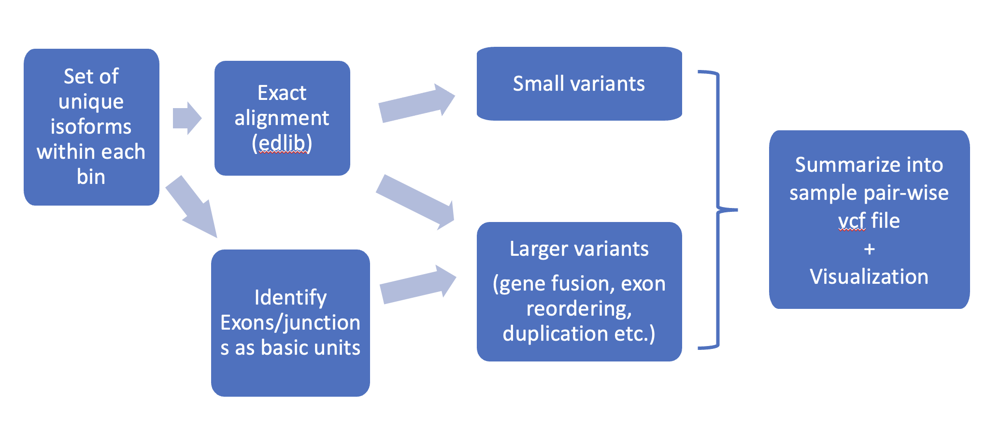

# RNAxSV : RNAseq isoforms and pathways bounded by evolutionarily conserved SVs

## Contributors
1. Evan	Biederstedt `(Leader, Liaison and Writer)`
2. Yutong	Qiu `(Sysadmin and code developer)`
3. Chia Sin	Liew `(Writer and analyst)`
4. Chase	Mateusiak `(Sysadmin and code developer)`
5. Rupesh	Kesharwani `(Sysadmin and analyst)`
6. Bida	Gu `(Sysadmin and code developer)
7. Muhammad Sohail Raza `(Writer and analyst)`

## Introduction
Gene fusions or transcript fusions are combinations of two genes or transcripts that are created by chromosomal rearrangement and a variety of genomic structural variations (SV), including translocations, inversions, deletions, and tandem duplications (DUP). These chromosomal signatures are distinctive to various cancer types and precision oncology such as in BCR-ABL1.
These hybrid genes and/or transcripts can be pedicted using a variety of computational tools and fusion detection techniques. However, when we wish to compare annotation over multiple samples, the lack of comparison tools makes it more difficult.

## Goals
The tool aims to compare mulitple annotation (gff and seq) of multiple samples. It provided information about chromosomal rearrnagements (fusions) of genes between the two or more annotations. 

## Description
The isoseq3 generated HQ (Full-length high quality i.e. accuracy of 99%) transcripts of HG002 (NA27730, NA24385 and NA26105) were mapped to GRCh38 using three different long read alignment tools (uLTRA, deSALT and Minimap2). Next, we performed cDNA_cupcake workflow to collapse the redundant isoforms from bam, followed by filtering the low counts isoforms by 10 and filter away 5' degraded isoforms that might not be biologically significant. And at last, generated corrected gff and fasta as final output which futher utilized as input for the our tool.

Commands:

`uLTRA mapping`
Then the data was processed with uLTRA [ PMID: 34302453 ] (v0.0.4.1; commands: uLTRA align --prefix prefix --isoseq --t 4 --index index_dir/ GRCh38.v33p13.primary_assembly.fa HG002.polished.hq.fastq.gz results_dir/).

`deSALT mapping`
Then the data was processed with deSALT [ PMID: 31842925 ] (v1.5.5; ; commands: deSALT aln -T -o HG002.sam -t 4 -x ccs HG002.polished.hq.fastq.gz).

`Minimap2 mapping`
Then the data was processed with Minimap2 [ PMID: 29750242 ] (v2.24-r1122; commands: minimap2 -t 8 -ax splice:hq -uf --secondary=no -C5 -O6,24 -B4 GRCh38.v33p13.primary_assembly.fa HG002.polished.hq.fastq.gz)

## Flowchart

### To extract sets of unique isoforms

### To annotate the unique isoforms

## Quick start

## Computational Resources / Operation

## References
1. https://agat.readthedocs.io/en/latest/tools/agat_sp_compare_two_annotations.html
2. https://ccb.jhu.edu/software/stringtie/gffcompare.shtml

